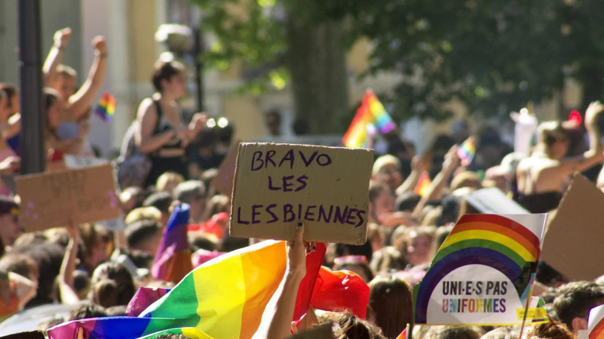

## L'association

Grenoble Fiertés organise depuis 2018, la Marche des Fiertés de Grenoble et la Quinzaine des Fiertés de Grenoble.

C'est une association loi 1901 à but non lucratif, fondée courant 2017, qui a pour objet d’organiser des évènements sur les thématiques [LGBTQIA+](https://fr.wikipedia.org/wiki/LGBTQIA+), notamment pour la visibilité et le militantisme pour les droits des personnes LGBTQIA+.

L'association est composée d'une dizaine d'adhérent-e-s, et fait appel chaque année à plus d'une cinquantaine de bénévoles dans le cadre de la journée de la Marche des Fiertés.

<a class="sparks" href="/contact">Nous contacter</a>  
<a class="sparks" href="/participer/faire-un-don">Faire un don</a>

<figure>

<figcaption><q>&nbsp;Bravo les lesbiennes&nbsp;!&nbsp;</q>, pancarte lors de la Pride 2022 — Crédit photo <a href="https://nileane.fr/@nileane" target="_blank">Niléane Dorffer</a> (2022).</figcaption>
</figure>

## La Pride de Grenoble

Grenoble Fiertés organise depuis 2018 la Quinzaine des Fiertés, qui regroupe de nombreux événements, ateliers, manifestations… qui s'inscrivent dans la lutte contre les discriminations liées à l’orientation sexuelle et l’identité de genre.

Cette quinzaine résulte d’une collaboration entre plusieurs associations LGBTQIA+ de Grenoble et des environs, dont le Centre LGBTI de Grenoble et ses membres.

Ces événements s'organisent avec la volonté de permettre au public de rencontrer les associations LGBTQIA+, de mettre en avant des thématiques culturelles et militantes LGBTQIA+, ainsi que des activités liées à la prévention et à la santé sexuelle.

## Historique de la Pride

<!-- TODO j'ai entendu parler d'une Pride organisée dans les années 80 ou
90 qui avait rassemblé quelques dizaines de personnes, ce serait intéressant
de retrouver une source qui en parle si c'est avéré -->

À l'origine, le Centre LGBTI de Grenoble (sous son ancien nom, le collectif CIGALE) organisait la Semaine des Fiertés durant une dizaine de jours, depuis 1996.

À partir de 2000, une petite Marche des Fiertés avait lieu à la fin ou au début de cette semaine, et rassemblait quelques dizaines de personnes, jusqu'en 2005. Dès 2006, la Marche et la Semaine des Fiertés n'ont plus lieu.

À l'occasion des 20 ans du centre LGBTI, en 2014, le Centre LGBTI organise de nouveau une Marche des Fiertés, qui rassemble beaucoup plus de monde, et qui se pérennise en se renouvelant en 2015 avec l'ajout d'une nouvelle édition de la Semaine des Fiertés.

L'association Grenoble Fiertés est constituée en 2017 par des membres d'associations du centre LGBTI suite à la Marche de cette année là, et reprend l'organisation de la Quinzaine des Fiertés, qui est ouverte par la Marche des Fiertés.

En 2020, les événements sont annulés en raison de la [situation sanitaire](https://fr.wikipedia.org/wiki/Pand%C3%A9mie_de_Covid-19_en_France).

### En savoir +

- Le [Grenoble Pride Festival dans Hétéroclite](http://www.heteroclite.org/2018/05/grenoble-pride-festival-centre-lgbti-51175) (2018)
- Il est possible de consulter quelques archives historiques des Prides en France sur [le site Hexagone Gay](http://www.hexagonegay.com/Gaypride2000.html). Il y a notamment des infos sur les éditions 2000 à 2005 de la Pride de Grenoble.
