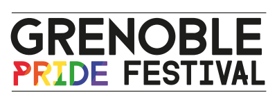

## L'association

Grenoble Fiertés est l'association qui organise, depuis 2018, la Marche des Fiertés de Grenoble et la Quinzaine des Fiertés de Grenoble / Grenoble Pride Festival.

C'est une association loi 1901 à but non lucratif, fondée courant 2017, qui a pour objet d’organiser des évènements sur les thématiques [LGBTQIA+](https://fr.wikipedia.org/wiki/LGBTQIA+), notamment pour la visibilité et le militantisme pour les droits des personnes LGBTQIA+.

L'association est composée d'une dizaine de bénévoles.

<a class="sparks" href="/contact">Nous contacter</a>  
<a class="sparks" href="/participer/faire-un-don">Faire un don</a>

## La Pride de Grenoble

L’association Grenoble Fiertés organise depuis 2018 le Grenoble Pride Festival, qui est une quinzaine d’événements et de manifestations de lutte contre les discriminations liées à l’orientation sexuelle et l’identité de genre. Cette quinzaine résulte d’une collaboration entre de nombreuses associations LGBTQIA+ de Grenoble et des environs, avec notamment le concours du Centre LGBTI de Grenoble et de ses associations membres.

Ces événements s'organisent avec la volonté de permettre au public de rencontrer les associations LGBTQIA+, de mettre en avant des thématiques culturelles et militantes LGBTQIA+, ainsi que des activités liées à la prévention et à la santé sexuelle.

## Historique de la Pride

<!-- TODO j'ai entendu parler d'une Pride organisée dans les années 80 ou
90 qui avait rassemblé quelques dizaines de personnes, ce serait intéressant
de retrouver une source qui en parle si c'est avéré -->

À l'origine, le Centre LGBTI de Grenoble (sous son ancien nom, le collectif CIGALE) organisait la Semaine des Fiertés durant une dizaine de jours, depuis 1996.

À partir de 2000, une petite Marche des Fiertés avait lieu à la fin ou au début de cette semaine, et rassemblait quelques dizaines de personnes, jusqu'en 2005. Dès 2006, la Marche et la Semaine des Fiertés n'ont plus lieu.

À l'occasion des 20 ans du centre LGBTI, en 2014, le Centre LGBTI organise de nouveau une Marche des Fiertés, qui rassemble beaucoup + de monde, et qui se pérennise en se renouvelant en 2015 avec l'ajout d'une nouvelle édition de la Semaine des Fiertés.

L'association Grenoble Fiertés est constituée en 2017 par des membres d'associations du centre LGBTI suite à la Marche de cette année, et reprend l'organisation de ce qui devient en 2018 le Grenoble Pride Festival : une quinzaine ouverte par la Marche des Fiertés.

En 2020, les événements sont annulés en raison de la [situation sanitaire](https://fr.wikipedia.org/wiki/Pand%C3%A9mie_de_Covid-19_en_France).

### En savoir +

- Le [Grenoble Pride Festival dans Hétéroclite](http://www.heteroclite.org/2018/05/grenoble-pride-festival-centre-lgbti-51175) (2018)
- Archives historiques des Pride en France sur le site Hexagone Gay :
  - [Année 2000](http://www.hexagonegay.com/Gaypride2000.html)
  - [Année 2001](http://www.hexagonegay.com/Gaypride2001.html)
  - [Année 2002](http://www.hexagonegay.com/Gaypride2002.html)
  - [Année 2003](http://www.hexagonegay.com/Gaypride2003.html)
    (il n'y a pas eu de Pride cette année-là à Grenoble)
  - [Année 2004](http://www.hexagonegay.com/Gaypride2004.html)
  - [Année 2005](http://www.hexagonegay.com/Gaypride2005.html)
